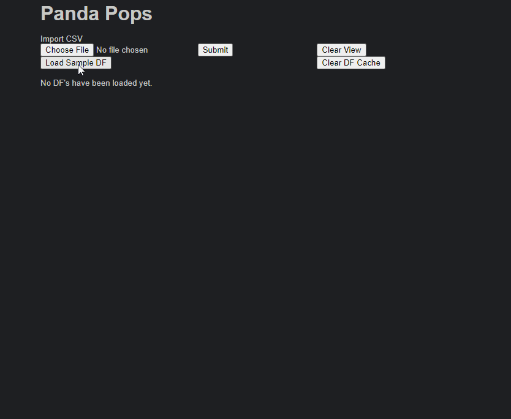
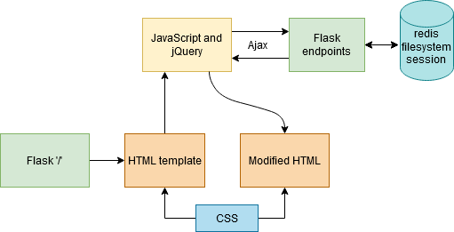

# Panda Ops

### Summary

A quick way to view and edit tabular data using the [pandas](https://pandas.pydata.org/) library for Python.

### Motivation
There are repetitive work flows that exist when dealing with tablular data which can be made into quicker, easier processes. These include, but are not limited to:
- Quickly loading a dataset.
- Easily switching between loaded datasets.
- Getting acquainted with existing values.
- Performing simple operations on columns.
- Checking for duplicate rows.

And most importantly, being able to do all these things together seamlessly.

### Snapshot

### Use

In Command Prompt, execute `flask run` and visit http://localhost:5000/ in your browser.

### Design

Below is the current SPA design that's being used. The initial HTML template that's served by Flask is modified by jQuery. When a user refreshes the page, its state gets reset to the initial HTML template. To avoid this, I added session variables in Flask that are used to propagate the correct state of the page. Now I am working towards adding something like React + Redux to make handling states easier.

