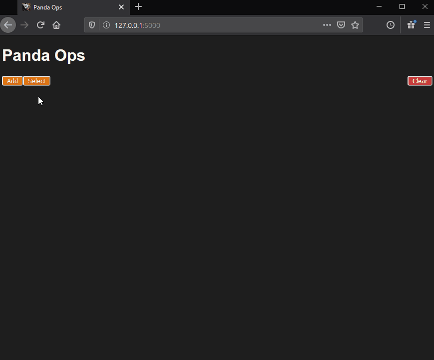
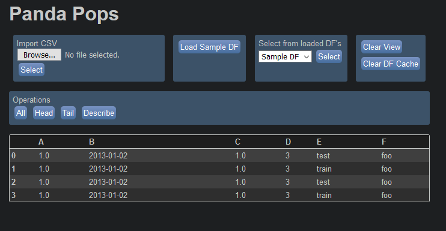
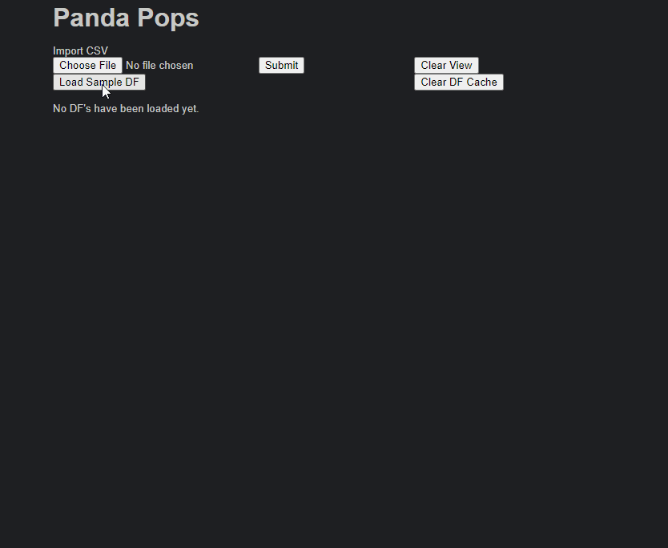

# Panda Ops

A quick way to view and edit tabular data using the [pandas](https://pandas.pydata.org/) library for Python.

### Motivation
There are repetitive work flows that exist when dealing with tablular data which can be made into quicker, easier processes. These include, but are not limited to:
- Quickly loading a dataset.
- Easily switching between loaded datasets.
- Getting acquainted with existing values.
- Performing simple operations on columns.
- Checking for duplicate rows.

And most importantly, being able to do all these things together seamlessly.

### Use

In Command Prompt, execute `flask run` and visit http://localhost:5000/ in your browser.

### Progress

#### Commit 3:
This was a big commit. I've changed all the POST requests which resulted in page refreshes on each webpage interaction into ajax requests. I also added better CSS styles. I'm pretty satisfied now with how dfs are being stored in-memory across requests (redis) and with how elements are updated dynamically without page refreshes (ajax requests). The other big features have yet to be added.

#### Commit 2:
Flask's session has been replaced with Redis to store dataframes across requests. Now we aren't limited by the max cookie size in FireFox (4096 bytes). Code in our main controller function has been cleaned up, and some CSS styling has been added too. Now to think of a better name for this project...

#### Commit 1:

The prototype:

