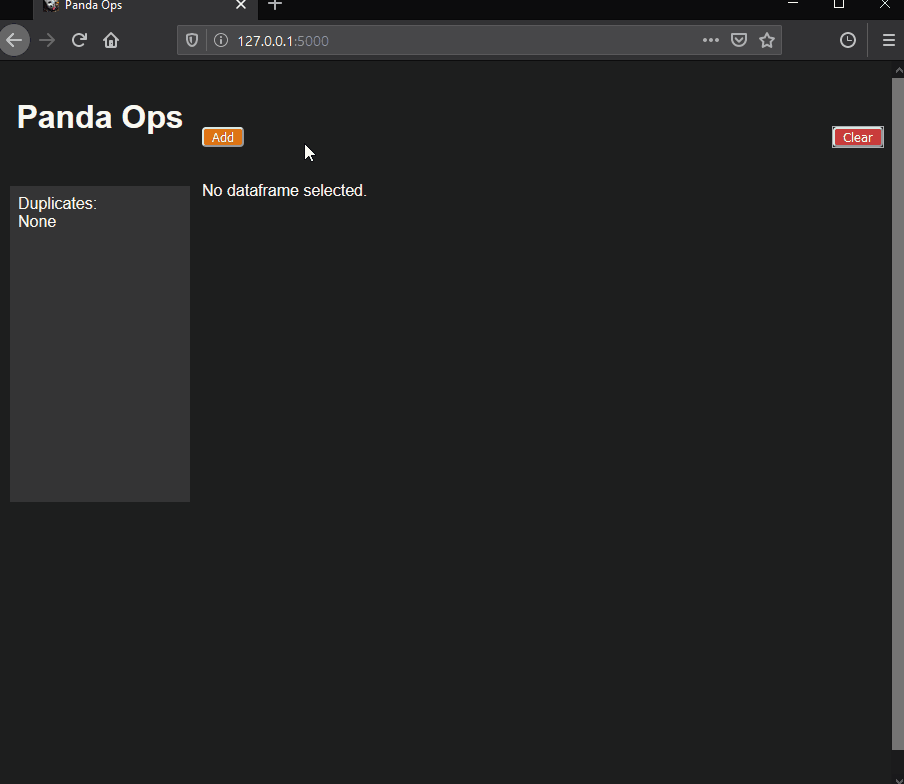

# Panda Pops

A quick way view and edit tabular data using the [pandas](https://pandas.pydata.org/) library for Python.

#### Motivation
There are repetitive work flows that exist when dealing with tablular data which can be made into quicker, easier processes. These include, but are not limited to:
- Quickly loading a dataset.
- Easily switching between loaded datasets.
- Getting acquainted with existing values.
- Performing simple operations on columns.
- Checking for duplicate rows.

And most importantly, being able to do all these things together seamlessly.

#### Use

In Command Prompt, execute `flask run` and visit http://localhost:5000/ in your browser.

#### Preview

